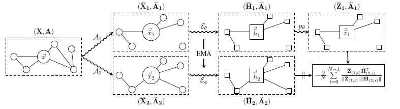

# BGRL_Pytorch
Implementation of Large-Scale Representation Learning on Graphs via Bootstrapping.

A PyTorch implementation of "<a href="https://arxiv.org/pdf/2102.06514.pdf">Large-Scale Representation Learning on Graphs via Bootstrapping</a>" paper, accepted in ICLR 2021 Workshop  
</img>

## Hyperparameters for training BGRL
Following Options can be passed to `train.py`
  

`--layers:` or `-l:`
one or more integer values specifying  the number of units for each GNN layer. Default is 512 256.  
usage example :`--layers 512 256`  
  

`--aug_params:` or `-p:`
four float values specifying the hyperparameters for graph augmentation (p_f1, p_f2, p_e1, p_e2). Default is 0.2 0.1 0.2 0.3.  
usage example : `--aug_params 0.2 0.1 0.2 0.3`

|params|WikiCS|Am.Computers|Am.Photos|Co.CS|Co.Physics|
|------|------|------------|---------|-----|----------| 
|p_f1  |0.2   |0.2         |0.1      |0.3  |0.1       |
|p_f2  |0.1   |0.1         |0.2      |0.4  |0.4       |
|p_e1  |0.2   |0.5         |0.4      |0.3  |0.4       |
|p_e2  |0.3   |0.4         |0.1      |0.2  |0.1       |
|embedding size|256|128|256|256|128|
|encoder hidden size|512|256|512|512|256|
|predictor hidden size|512|512|512|512|512|
* Hyperparameters are from original paper

## Experimental Results
|WikiCS|Am.Computers|Am.Photos|Co.CS|Co.Physics|
|------|------------|---------|-----|----------| 
|79.50 |88.21       |92.76    |92.49|94.89     |

## Codes borrowed from
Codes are borrowed from BYOL and SelfGNN

| name        | Implementation Code | Paper   |
| ----------- | ------------------- | ------- | 
| `Bootstrap Your Own Latent`| <a href="https://github.com/lucidrains/byol-pytorch">Implementation</a>| <a href="https://arxiv.org/pdf/2006.07733.pdf">paper</a>|
| `SelfGNN`| <a href="https://github.com/zekarias-tilahun/SelfGNN">Implementation</a>| <a href="https://arxiv.org/pdf/2103.14958.pdf">paper</a>|
